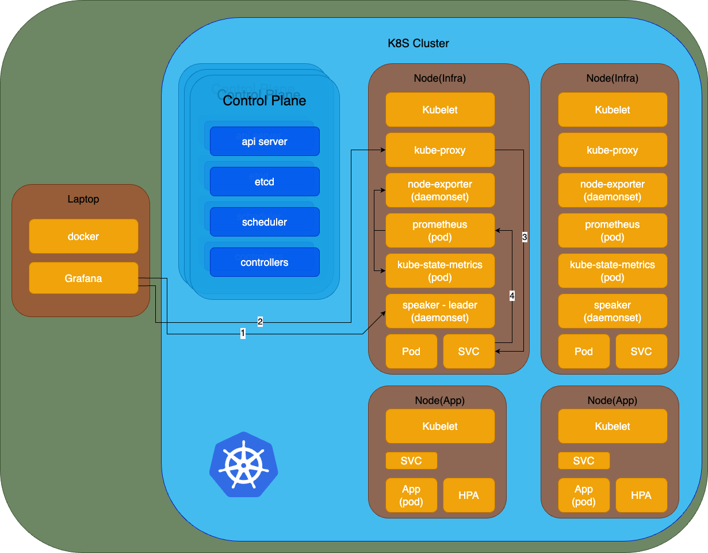

# kind-k8s


# Infra overview


## Installation
### kind
#### For ARM64
```
$ [ $(uname -m) = aarch64 ] && curl -Lo ./kind https://kind.sigs.k8s.io/dl/v0.24.0/kind-linux-arm64
$ chmod +x ./kind
$ sudo mv ./kind /usr/local/bin/kind
```
## Setup k8s cluster
`$ kind create cluster --config kind-config.yaml`

Label workder node
```
kubectl label node kind-worker kind-worker2 node-role.kubernetes.io/worker=infra
kubectl label node kind-worker kind-worker2 node-role.kubernetes.io/infra=
kubectl label node kind-worker3 kind-worker4 node-role.kubernetes.io/worker=app
kubectl label node kind-worker3 kind-worker4 node-role.kubernetes.io/app=
```
## Setup MatalLB
enabling strict ARP
```
kubectl get configmap kube-proxy -n kube-system -o yaml | \
sed -e "s/strictARP: false/strictARP: true/" | \
kubectl apply -f - -n kube-system
```


get config file and add line to `metallb-frr.yaml`
``` 
$ wget https://raw.githubusercontent.com/metallb/metallb/v0.14.8/config/manifests/metallb-frr.yaml
```

Edit metallb-frr.yaml and add line at #2052
``` 
kubernetes.io/role: "infra"
```

```
kubectl apply -f metallb-frr.yaml
kubectl apply -f ipv4-pool.yaml
kubectl apply -f L2advertisement.yaml 
```


# Prometheus

## Setup
```
kubectl create namespace prometheus
kubectl apply -f prometheus.yaml
kubectl apply -f node-exporter-deploy.yaml
kubectl apply -f kube-state-metrics-values.yaml
```


# Grafana

## Setup
```
docker compose up -d
```

## Dashboard setup
```
Add prometheus service EXTERNAL-IP as datasource
Import dashboard json files
```

### 5.1 效能監控儀表板 (1): 呈現 node 的效能監控數據

- **CPU 使用率 (CPU Utilization)**:  
  顯示每個 node 的 CPU 使用率百分比，監控資源的利用情況。

- **內存使用率 (Memory Utilization)**:  
  顯示每個 node 的內存使用量，包括已用和可用內存，以確保內存不過載。

- **磁碟 I/O (Disk I/O)**:  
  測量每個 node 的讀寫速率，檢查磁碟使用是否飽和。

- **網路 I/O (Network I/O)**:  
  顯示網路的吞吐量，包括傳入和傳出流量，監控網路性能。

- **node 可靠性 (Node Health)**:  
  包括 node 的狀態，如是否健康、是否在線等。

---

### 5.2 效能監控儀表板 (2): 呈現 cluster 的效能監控數據

- **總 CPU 使用率 (Cluster-wide CPU Utilization)**:  
  顯示整個 cluster 的總 CPU 使用率。

- **總內存使用率 (Cluster-wide Memory Utilization)**:  
  顯示 cluster 中所有 node 的總內存使用情況。

- **Pod 分配情況 (Pod Distribution)**:  
  顯示 cluster 中不同 node 的 pod 分佈情況。

- **總磁碟使用率 (Cluster-wide Disk Usage)**:  
  總結 cluster 中所有 node 的磁碟使用情況。

- **事件日誌 (Event Logs)**:  
  顯示 cluster 中的重要事件，例如 pod 崩潰、資源不足等。

---

### 5.3 效能監控儀表板 (3): USE (Utilization, Saturation, Errors) 角度的效能監控數據

- **利用率 (Utilization)**:  
  顯示每個 node 和資源（CPU、內存、磁碟、網路）的實際使用率，衡量資源利用情況。

- **飽和度 (Saturation)**:  
  監控資源是否接近使用極限，如 CPU 飽和、磁碟滿載等，反映系統壓力。

- **錯誤率 (Error Rate)**:  
  測量各種錯誤情況，例如網路錯誤、磁碟讀寫錯誤等，幫助識別性能瓶頸。

---

### 5.4 效能監控儀表板 (4): 呈現 etcd 的效能監控數據

- **etcd 諮詢延遲 (etcd Latency)**:  
  測量 etcd 查詢和寫入操作的延遲，確保數據存儲反應速度正常。

- **etcd 狀態 (etcd Health)**:  
  顯示 etcd 集群的健康狀態，包括節點是否正常運行、是否有失敗的節點。

- **etcd 存儲大小 (etcd Disk Usage)**:  
  監控 etcd 存儲使用量，避免存儲瓶頸。

- **etcd 諮詢錯誤 (etcd Errors)**:  
  顯示 etcd 操作中的錯誤次數，確保其可靠性。

---

### 5.5 效能監控儀表板 (5): 呈現 Prometheus 的效能監控數據

- **Prometheus 查詢延遲 (Prometheus Query Latency)**:  
  測量 Prometheus 執行查詢的延遲時間，反映監控數據的獲取速度。

- **Prometheus 存儲使用 (Prometheus Storage Usage)**:  
  顯示 Prometheus 存儲數據的容量使用情況，確保其不會滿載。

- **Prometheus 抓取頻率 (Prometheus Scrape Intervals)**:  
  顯示 Prometheus 從目標系統抓取數據的頻率，保證監控數據是最新的。

- **Prometheus 錯誤率 (Prometheus Errors)**:  
  監控 Prometheus 的錯誤發生情況，例如無法抓取數據或查詢失敗。

---

### 5.7 要具體觀察 CPU Throttling，建議新增一個專門的監控 panel，原因如下：

1. **新增 CPU Throttling Panel 的原因**：
   - 現有的效能儀表板提供的數據比較宏觀，無法直接反映 CPU Throttling 的具體情況。我們需要專門的面板來捕捉這一現象。

2. **新增的監控 panel**：
   - **CPU CFS Quota Monitoring**:
     - 這是一個用來專門監控容器是否達到其 CPU 配額限制的 panel。可以使用 `container_cpu_cfs_throttled_seconds_total` 指標（來自 Prometheus），該指標可以顯示每個容器 CPU 被節流的時間。
     - **數據顯示**: 這個 panel 將顯示每個容器被節流的時間比例，幫助識別那些容器正在頻繁遭遇 CPU Throttling 的情況。

```
Example:
rate(container_cpu_cfs_throttled_seconds_total[5m])
```